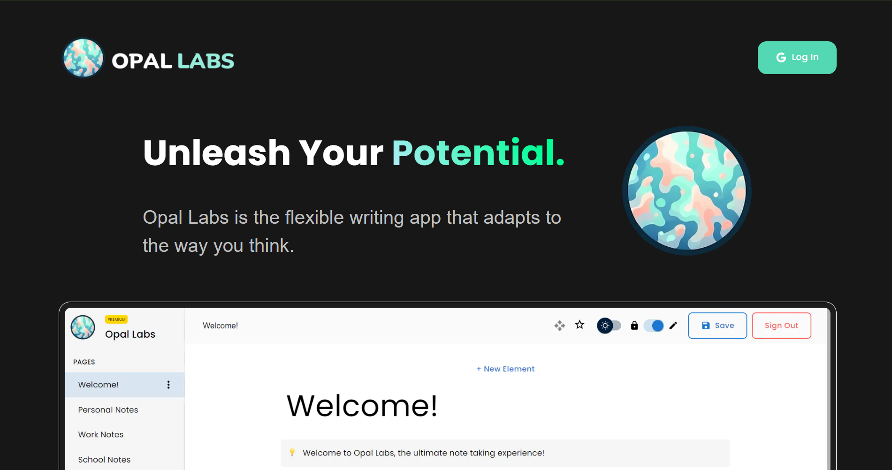

# 🚀 Opal Labs — Frontend

A modern, Notion-like productivity platform built with cutting-edge web technologies.

<a href="https://opal-labs.vercel.app/" target="_blank" rel="noreferrer">
  
</a>

<br />

[🌐 Live Demo](https://opal-labs.vercel.app/) •
[🛠 Backend Repo](https://github.com/AbdulDevHub/Opal-Labs-Backend)

<br />


</div>

---

## ✨ Introduction

This is a **public copy of a private repository** where I am collaborating with a **team of 7 developers** to build a Notion-like productivity application.

This repository contains the **frontend** portion of the project.  
For the backend implementation, visit 👉 **[Opal Labs Backend](https://github.com/AbdulDevHub/Opal-Labs-Backend)**

### 🧱 Tech Stack

- **Framework:** Next.js (App Router)
- **Language:** TypeScript
- **Auth:** Google OAuth 2.0
- **Database:** PostgreSQL
- **Caching:** Redis
- **Testing:** Playwright
- **Backend Language:** Go
- **Methodology:** Agile

---

## 🛠 Setup

```bash
yarn install
````

1. Install all required workspace `@recommended` extensions
2. Add the required `.env` values from the team drive

---

## 🚀 Getting Started

Start the development server:

```bash
yarn dev
```

Then open:

👉 **[http://localhost:3000](http://localhost:3000)**

---

## 🔐 Google OAuth 2.0

Follow the instructions in the shared document:

👉 [Google OAuth 2.0 Setup Guide](https://drive.google.com/drive/folders/1PWzpsJGXIDA_RnRRoEcJe_U5yvGC6s_U?usp=sharing)

---

## 📘 Storybook

Run Storybook on port **6000**:

```bash
yarn storybook
```

---

## 🧪 Testing & Quality Checks

Run linting and type checks:

```bash
yarn lint
yarn check-types
```

These commands run:

- **Pre-push** via `husky`
- **CI/CD** via GitHub Actions

---

## 🎭 Playwright Testing

Playwright is used for **end-to-end testing** of user interactions and API flows.

### Usage

1. Install dependencies:

   ```bash
   yarn
   ```

2. Start the dev server:

   ```bash
   yarn dev
   ```

3. Generate test code:

   ```bash
   npx playwright codegen
   ```

4. Save generated tests to:

   ```text
   tests/TestWithoutBackend.spec.ts
   ```

5. Run tests:

   ```bash
   npx playwright test
   ```

6. View reports:

   ```bash
   npx playwright show-report
   ```

7. Run tests visually:

   ```bash
   npx playwright test --ui
   ```

📚 Learn more: [Playwright Documentation](https://playwright.dev/docs/intro)

---

## 🤝 Contributing

Contributions are welcome!

- Open an issue for bugs or feature requests
- Submit a PR for improvements

---

## 📄 License

This project is licensed under the **MIT License**.
See the [LICENSE](LICENSE) file for details.
